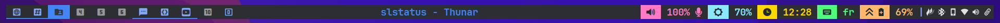

<div align="center">

# marwatoo/slstatus

**A personalized build of [slstatus](https://tools.suckless.org/slstatus/) — a suckless status monitor for dwm**

*Colored, icon-driven bar segments · Nerd Font glyphs · Custom volume/brightness scripts*




</div>

---

## About

This is a personal configuration of **slstatus**, the suckless status monitor. slstatus itself is unmodified upstream C — the customization lives entirely in `config.h`, where each status segment is wrapped in color-markup and Nerd Font icons to produce a colorful, segmented bar that feeds directly into [marwatoo/dwm](https://github.com/marwatoo/dwm)'s status area.

It's built to pair with the `drawstatusbar()` color-parsing patch in that dwm build, and can be swapped at runtime with [marwatoo/dwmblocks](https://github.com/marwatoo/dwmblocks) depending on whether polling (slstatus) or signal-driven blocks (dwmblocks) is preferred.

## Table of Contents

- [Configuration Highlights](#configuration-highlights)
- [Active Status Segments](#active-status-segments)
- [Requirements](#requirements)
- [Installation](#installation)
- [Running slstatus](#running-slstatus)
- [All Available Modules](#all-available-modules)
- [Credits](#credits)

## Configuration Highlights

Every item below was verified against the actual `config.h` in this repo:

| Feature | Description |
|---|---|
| **Colored segments** | Each block is wrapped in `^b#hex^^c#hex^ ... ^d^` markup — background color, foreground color, then reset — matching the color-code syntax expected by a `statuscolors`/`status2d`-style dwm patch. |
| **Per-segment background/foreground pairs** | Alternating background/foreground colors give each segment its own "pill" look in the bar (e.g. Dracula-inspired purple, cyan, yellow, green, orange tones). |
| **Nerd Font icons** | Icons are embedded directly ahead of each value inside the format string rather than handled as a separate icon system. |
| **Delegated scripts for volume/brightness** | Rather than using slstatus's built-in `vol_perc` module, volume and brightness are read via `run_command` calls to `~/.config/dwm/svol.sh` and `~/.config/dwm/sbright.sh`, allowing full control over how those values are computed and displayed (e.g. for `pactl`/`brightnessctl`-based setups). |
| **1-second refresh interval** | `interval = 1000` (ms) — fast enough for a responsive volume/brightness readout without hammering the CPU. |

## Active Status Segments

In order, left to right, as defined in `config.h`:

| Segment | Source | Notes |
|---|---|---|
| Volume | `run_command` → `svol.sh` | Custom script, likely wrapping `pactl` |
| Brightness | `run_command` → `sbright.sh` | Custom script, likely wrapping `brightnessctl` |
| Time | `datetime` | Format: `%R` (24-hour `HH:MM`) |
| Keymap | `keymap` | Current keyboard layout |
| Battery state | `battery_state` | Charging/discharging indicator for `BAT0` |
| Battery percentage | `battery_perc` | Percentage remaining for `BAT0` |

## Requirements

slstatus works on FreeBSD, Linux, and OpenBSD, and needs the Xlib header files to build.

- Xlib development headers (`libx11-dev` on Debian/Ubuntu)
- For volume percentage on Linux: the `snd-mixer-oss` kernel module (not required here, since volume is read via an external script instead)

## Installation

```bash
git clone https://github.com/marwatoo/slstatus.git
cd slstatus
```

Edit `config.mk` to match your local setup (installs into `/usr/local` by default), then:

```bash
sudo make clean install
```

## Running slstatus

slstatus writes directly to the X root window name, which dwm reads as its status text:

```bash
slstatus &
exec dwm
```

Or output to stdout instead, for piping into another bar consumer:

```bash
slstatus -1
```

## All Available Modules

Upstream slstatus ships with the following modules, any of which can be added to `config.h`'s `args[]` array:

Battery percentage/state/time left · file `cat` · CPU usage/frequency · custom shell commands · date & time · disk usage · entropy · username/UID/GID · hostname · IPv4/IPv6 · kernel version · keyboard indicators · keymap · load average · network speed (RX/TX) · file count in a directory · memory usage · swap usage · temperature · uptime · volume percentage · WiFi ESSID/signal.

## Credits

- [suckless.org](https://tools.suckless.org/slstatus/) — original slstatus
- Paired with [marwatoo/dwm](https://github.com/marwatoo/dwm) and [marwatoo/dwmblocks](https://github.com/marwatoo/dwmblocks)

---

<div align="center">

*See [LICENSE](LICENSE) for copyright and license details (MIT, following upstream slstatus).*

</div>